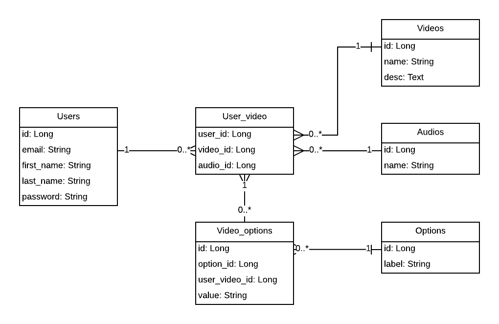

# VOS aplikácia

Zatial je to len jednoduchá rails aplikácia. Používa databázu postgreSQL, ktorú mám dockerizovanú.

Aplikácia by mala slúžiť na výber, úpravu a následné zakúpenie profesionálnych videí.

V databáze mám zatial iba jednu vlastnú tabulku- na samotné videá. Tie sú aj hlavnou vecou, ktorú 
zatial aplikácia rieši. Viem si prezriek aktuálne videá, pridať alebo odstrániť nové. 
S videami pracujem pomocou ffmpeg, ktoré volám pomocou background workerov. Na tie používam 
gem Sidekiq. K nemu mám rozbehanú Redis databázu, lebo ju tento gem používa na ukladanie 
jobov.

Prvou funkcionalitou, implementovanou v aplikácií je vytváranie thumbnailov- 
screenshotov z videa pri jeho tvorbe, ktoré sa potom na stránke zobrazujú.

Na ukladanie videí používam Active Storage. Ten vie k objektu priradiť nejaký väčší súbor, o ktorého
uskladnenie sa potom stará. V datovom modeli tieto attachmenty nie sú zakreslene

Dátový model: 

 

Zatiaľ sa model týka iba základnej funkcionality. Používatel si vyberie video na úpravu a
pri upravovaní zasa audio a nejaké efekty, ktoré sú uložené v tabulke options. Tá bude číselník.
Jednou z možností bude aj napríklad pridať text.

Ked bude chcieť používateĺ vidieť výsledné video, pomocou ffmpeg sa to poskladá na 
pozadí a zobrazí sa mu. Mohol by som ukladať iba zmenené video ale problém by 
nastal keby chcel pouźívateľ v budúcnosti toto video zmeniť. Kvoli rýchlosti aplikácie by zasa nebolo praktické
ukladať iba parametre a potom vždy nanovo skladať video. Preto si myslím že najlepšie riešenie
je ukladať aj aktuálnu verziu videa, pomocou aktive storage aj kroky ako sa k tejto verzií používateľ dostal.
